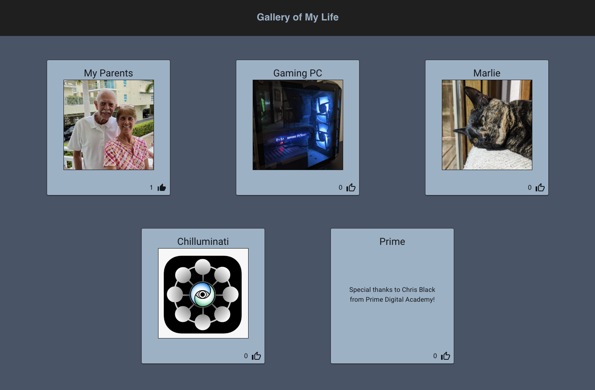

# Weekend Challenge - React Gallery

## Description

Duration: A few days of work over a two week period

The goal of this project was to create a gallery of images on the page. Each image has a title, a description and a thumbs-up icon that the user can click to add a like the image. Clicking on an image will change the display of the associated card to show the description, and clicking the description will change the display back to the image. The width of the gallery maxes out at 3 images wide.

I learned a lot about React props, conditional rendering and Material UI while working on this project and I had a lot of fun putting it all together.

## Preview

## Prerequisites

1. Node.js
2. React
3. Nodemon

## Installation

1. Running the server code requires `nodemon`. If you don't already have `nodemon`, install it globally with `npm install nodemon --global`

2. In a terminal window, type `npm install` and then `npm run server`

3. In a new terminal window, type `npm run client`

## Built With

1. React
2. MaterialUI
3. Node.js
4. Axios

## Acknowledgement

Thanks to Chris Black and Prime Digital Academy for providing me with the knowledge I needed to make this!

## Support

If you have issues or suggestions, please feel free to email me at erichjohnengler@gmail.com

Thanks!
