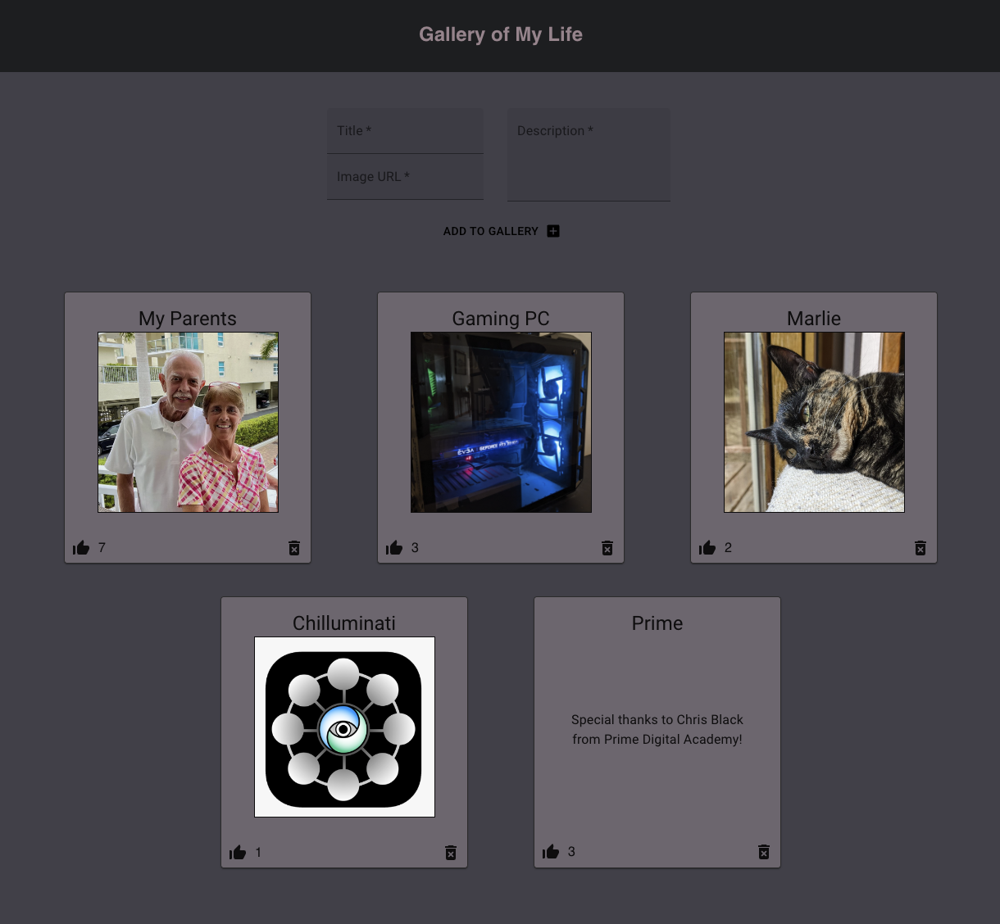

# Weekend Challenge - React Gallery

## Description

Duration (base): A few days of work over a two week period
Duration (stretch): Another couple days

The project contains a gallery of images. These images are of important people or things in my life! Each image has a title, a description, a delete icon and a thumbs-up icon with the number of likes the image has. The width of the gallery maxes out at 3 images wide. Users can post a new gallery item by using the form at the top of the page.

I came back to this assignment and moved the data (titles, images, descriptions and likes) to a database to attempt some stretch goals and to mess around some more with Material UI.

## Preview

## Installation / Setup

1. Clone down this repository. You will need node and npm installed globally on your machine.
2. Create a database named `react_gallery`
3. Create a table and insert values using the information in `database.sql`
4. In a terminal window, type `npm install` and then `npm run server`
5. In a new terminal window, type `npm run client`

## Usage

To submit a new gallery item, the user can use the form at the top of the page to input a title, image URL and description and click the `Add to Gallery` button to submit.

If the user wishes to delete a gallery item from the gallery, they can click the delete icon in the bottom right corner below the image they wish to delete. This will remove the item from the database and it will no longer be displayed.

The user can click the thumbs-up icon in the bottom left corner below an image to add a like to that image. The amount of likes each image has is stored in the database. 

If the user clicks on an image, this will change the display of the associated card to show a description of that image. If the user clicks on the description, this will change the display back to the image.

## Built With

- JavaScript
- React
- MaterialUI
- Node.js
- Axios
- PostgreSQL

## Reflection

I learned a lot about React props, conditional rendering and Material UI while working on this project and I had a lot of fun putting it all together. Material UI seems like a very easy way to make your projects look a lot better and I find it really fun to mess around with it! 

## Acknowledgement

Thanks to Chris Black and Prime Digital Academy for making this possible!

## Support

If you have issues or suggestions, please email me at erichjohnengler@gmail.com

Thanks!
